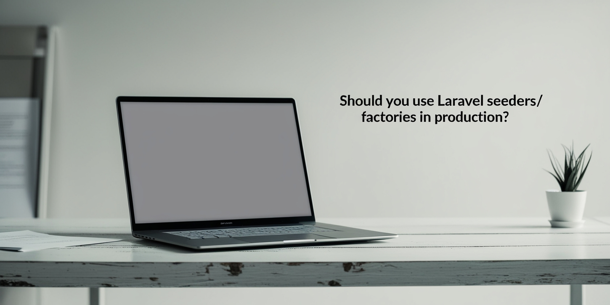

# Should You Use Laravel Seeders/Factories in Production?

Concise guide exploring the debate on whether Laravel's seeding and factory features belong in production environments.

## Key Points

- **Factories in Production**: Generally discouraged due to security issues, unintended fake data generation, and
  unexpected model relationships.

- **Seeders in Production**: Often problematic due to maintenance issues, environment inconsistencies, and potential
  model limitations.

- **Recommended Approach**: Use migrations with DB facade for inserting static data in production environments.

- **Local Environment Usage**: Consider "Local Environment Seeders" for development purposes - simplifying UI testing,
  onboarding, and edge case testing.

## Best Practices

- Use enums for consistent data
- Avoid direct model usage in seeders, stick with DB interface
- Choose insert methods that handle duplicates gracefully
- Design seeders with modularity in mind

## Conclusion

While factories and seeders are valuable tools for development and testing, migrations are typically recommended for
adding static data to production environments, providing better long-term stability and maintenance.

## Learn More

Read the full article: [Should You Use Laravel Seeders/Factories in Production?](https://dev.to/tegos/should-you-use-laravel-seedersfactories-in-production-51ai)

